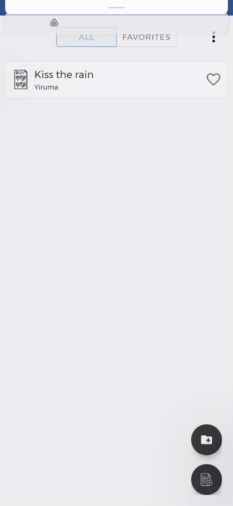

# DigiMuScore
DigiMuScore is a sheet music manager Android application. You can organize sheet musics in folder, annotate them, and automatic page turning based on head motions. 

## Getting Started

### Prerequisties

- OpenCV4Android sdk (download it from [sourceforge](https://sourceforge.net/projects/opencvlibrary/files/opencv-android/))

### Installation
Clone the repo, then import into Android Studio
```
git clone https://github.com/zhouppei/DigiMuScore.git
```

### Configuration
Change OpenCV4Android sdk path in `gradle.properties`
```
opencvsdk=/path/to/opencv4androidsdk
```


## Features

### Manage sheet musics

 

 


### Manage sheet music page

 


### Annotate

 

 


### Settings


